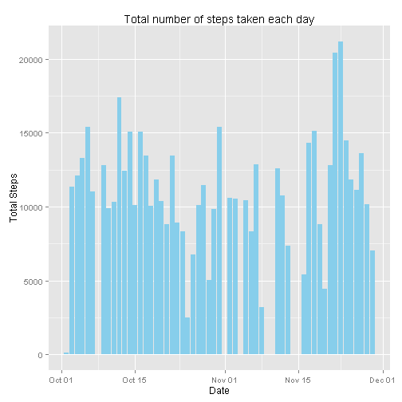
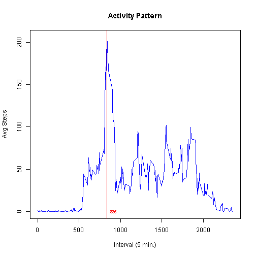
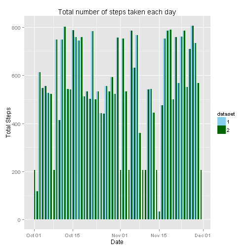
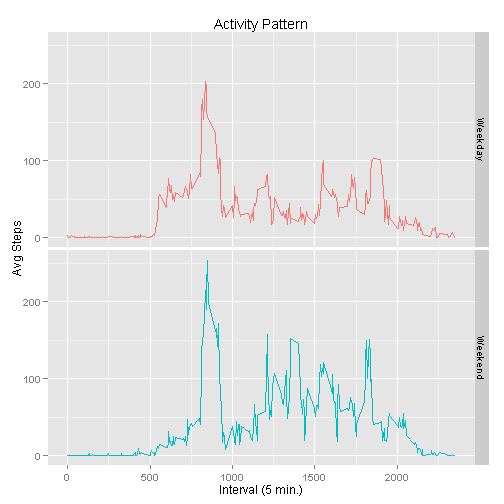
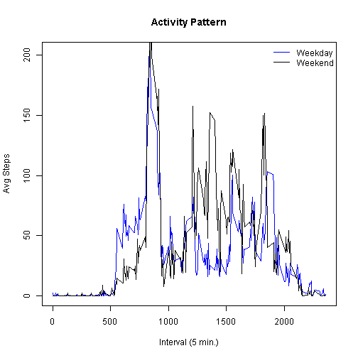

This document records the steps processing data from a personal activity monitoring device. This device collects data at 5 minute intervals through out the day. The data consists of two months of data from an anonymous individual collected during the months of October and November, 2012 and include the number of steps taken in 5 minute intervals each day. 

Source data: <https://d396qusza40orc.cloudfront.net/repdata%2Fdata%2Factivity.zip>.

### Loading and preprocessing the data

After setting up working directory, read the personal activity monitoring data from data source file into R:


```r
pam_data <- read.csv("activity.csv",as.is=TRUE)
str(pam_data)
```

```
## 'data.frame':	17568 obs. of  3 variables:
##  $ steps   : int  NA NA NA NA NA NA NA NA NA NA ...
##  $ date    : chr  "2012-10-01" "2012-10-01" "2012-10-01" "2012-10-01" ...
##  $ interval: int  0 5 10 15 20 25 30 35 40 45 ...
```

Obviously, we need to fix the date field:


```r
pam_data$date <- as.Date(pam_data$date)
```

### Mean total number of steps taken per day

Get the pacakges ready for calculationa dn plotting:


```r
library(dplyr)
library(ggplot2)
```

We plot a histogram of the total number of steps taken each day:

```r
ggplot(pam_data, aes(x=date, y=steps)) + 
  geom_bar(stat='identity',fill='skyblue') + 
  ylab("Total Steps") + xlab("Date") + labs(title="Total number of steps taken each day")
```

```
## Warning: Removed 2304 rows containing missing values (position_stack).
```

 

Now calculate the mean and median total number of steps taken per day:


```r
pam <- tbl_df(pam_data) %>% filter(!is.na(steps)) %>% group_by(date) %>% summarize(avgsteps=mean(steps))
summary(pam)
```

```
##       date               avgsteps      
##  Min.   :2012-10-02   Min.   : 0.1424  
##  1st Qu.:2012-10-16   1st Qu.:30.6979  
##  Median :2012-10-29   Median :37.3785  
##  Mean   :2012-10-30   Mean   :37.3826  
##  3rd Qu.:2012-11-16   3rd Qu.:46.1597  
##  Max.   :2012-11-29   Max.   :73.5903
```

We have mean = 37.3826 and median = 37.3785, which are almost the same.

### Average daily activity pattern

Calculate average daily steps of each interval (ignoring NAs):


```r
pam <- tbl_df(pam_data) %>% filter(!is.na(steps)) %>% group_by(interval) %>% summarize(avgsteps=mean(steps))
```

Now we can figure out which interval has highest average number of steps:

```r
summary(pam)
```

```
##     interval         avgsteps      
##  Min.   :   0.0   Min.   :  0.000  
##  1st Qu.: 588.8   1st Qu.:  2.486  
##  Median :1177.5   Median : 34.113  
##  Mean   :1177.5   Mean   : 37.383  
##  3rd Qu.:1766.2   3rd Qu.: 52.835  
##  Max.   :2355.0   Max.   :206.170
```

```r
pam[which(pam$avgsteps>206),]
```

```
## Source: local data frame [1 x 2]
## 
##     interval avgsteps
## 104      835 206.1698
```

So Interval 835 has the maximum, and let's see it along with the plot of activity pattern:


```r
plot(pam$interval, pam$avgsteps, type='l', col='blue', main='Activity Pattern', xlab='Interval (5 min.)',ylab='Avg Steps')
abline(v=835, col='red')
text(835,0,pos=4,col='red',label='835',cex=0.7)
```

 

### Imputing missing values

ggplot already gives the warning on missing values (Steps == NA), and we can confirm that:

```r
sum(is.na(pam_data$steps))
```

```
## [1] 2304
```
Indeed, there are 2304 missing values.

The presence of missing days may introduce bias into some calculations or summaries of the data, so let's devise a strategy for filling in all of the missing values in the dataset. What we do here is to use the mean for that 5-minute interval to replace NAs, which should be a reasonable estimate of activity.


```r
pam <- tbl_df(pam_data) %>% filter(!is.na(steps)) %>% group_by(interval) %>% summarize(avgsteps=mean(steps))
pam_fill <- merge(pam_data, pam, by='interval')
fill_index <- which(is.na(pam_fill$steps))
pam_fill$steps[fill_index] <- pam_fill$avgsteps[fill_index]
```

With this new dataset that has the missing data filled in, we repeat our exploration to make the histogram of the total number of steps taken each day and calculate the mean and median total number of steps taken per day;

```r
nudf <- rbind(data.frame(dataset=1, pam_data), data.frame(dataset=2, pam_fill[,1:3]))
nudf$dataset <- as.factor(nudf$dataset)

ggplot(nudf, aes(x=date, y=steps, fill=dataset)) + 
  geom_bar(stat='identity', position="dodge") + 
  ylab("Total Steps") + xlab("Date") + labs(title="Total number of steps taken each day") +
  scale_fill_manual(breaks=1:2, values=c('skyblue','darkgreen')) 
```

 

The side-by-side comparison indicates that after filling in NAs, missing value days have more non zero values of steps included in the new dataset (labeled as dataset=2). As the result the original bias towarding lower values are fixed, and orignal median should move up a bit.  Let's verify this:


```r
pam <- tbl_df(pam_fill) %>% select(steps, date) %>% group_by(date) %>% summarize(avgsteps=mean(steps))
summary(pam)
```

```
##       date               avgsteps      
##  Min.   :2012-10-01   Min.   : 0.1424  
##  1st Qu.:2012-10-16   1st Qu.:34.0938  
##  Median :2012-10-31   Median :37.3826  
##  Mean   :2012-10-31   Mean   :37.3826  
##  3rd Qu.:2012-11-15   3rd Qu.:44.4826  
##  Max.   :2012-11-30   Max.   :73.5903
```
After filling, the mean is the same at 37.3826, but median moves up from original 37.3785 to 37.3826.


### Activity patterns between weekdays and weekends

We want to check if activities are different at weekdays vs weekends.  First we tranform the dates into factor values of weekday or weekend:


```r
library(lubridate)
pam_fill$day <- wday(pam_fill$date) > 5
pam_fill$day <- as.factor(pam_fill$day)
levels(pam_fill$day) <- c("Weekday","Weekend")
pam <- tbl_df(pam_fill) %>% select(steps, interval, day) %>% group_by(day, interval) %>% summarize(avgsteps=mean(steps))

ggplot(pam, aes(x=interval, y=avgsteps, color=day)) + geom_line() + 
  ylab("Avg Steps") + xlab("Interval (5 min.)") + labs(title="Activity Pattern") +
  guides(colour=FALSE) + facet_grid(day~.)
```

 

Hm, looks like weekend activities are more intense than weekday's.

Finally, in this extra plot, we put the activity patterns together for comparison.


```r
plot(pam$interval[pam$day=='Weekday'], pam$avgsteps[pam$day=='Weekday'], type='l', col='blue', main='Activity Pattern', xlab='Interval (5 min.)',ylab='Avg Steps')
lines(pam$interval[pam$day=='Weekend'], pam$avgsteps[pam$day=='Weekend'])
legend('topright', levels(pam_fill$day), lty=1, col=c('blue','black'), bty='n')
```

 
